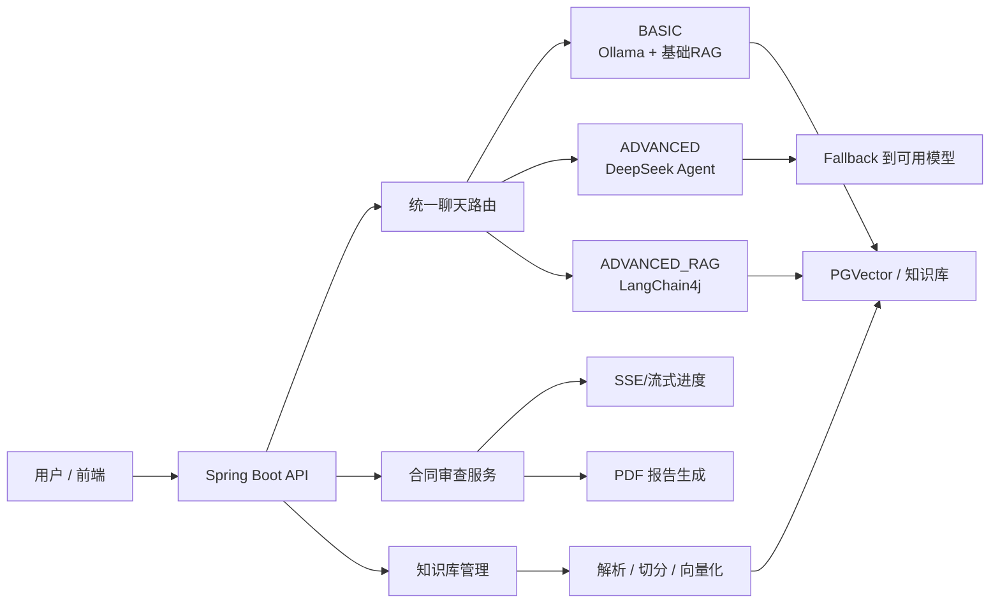

[简体中文](./README.md) | [English](./README_EN.md)

# 法律合规 AI 助手

一个面向春招 AI 应用开发岗位展示的法律合规项目：用 `Spring AI + LangChain4j + RAG + Agent + SSE` 做统一问答、合同审查、报告生成与知识库管理，并补齐了**路由、降级、可观测性、验证与演示材料**。

## 项目定位

这不是一个“接了大模型 API 的课程作业”，而是一个强调 **AI 工程化落地** 的项目：

- **统一聊天入口**：同一套接口支持 `BASIC / ADVANCED / ADVANCED_RAG / UNIFIED`
- **多模型路由**：根据问题复杂度在 Agent 与高级 RAG 之间切换
- **检索增强**：法律知识库支持切分、向量化、检索与重建
- **流式交互**：合同审查采用异步流式进度推送
- **降级回退**：DeepSeek 不可用时，`ADVANCED` 不再直接失败，而是回退到可用路径
- **可解释响应**：聊天结果稳定返回模型、路由、降级、来源数、延迟等 metadata

## 这轮冲刺做了什么

### P0：先消灭面试红旗

- 移除了 README 首页“停止维护”这类负面叙事
- 修复了后端回归问题，`./mvnw test` 可通过
- 统一了 `ADVANCED` 模式语义：优先 DeepSeek，高级能力不可用时回退可用模型
- 新增合同分析主展示接口：`Authorization` Header 认证版异步流
- 将明文密码示例工具移出主业务源码，避免默认包 + 硬编码口令成为减分项

### P1：把 AI 工程化做成显性卖点

- 补齐了统一聊天 metadata 稳定字段：
  - `actualModel`
  - `routeReason`
  - `fallbackUsed`
  - `sourceCount`
  - `latencyMs`
- 前端聊天页直接展示模型、路由、知识库使用、降级与延迟
- 准备了可复用评测数据集：`24` 条问答样例、`6` 份知识库样例、`3` 份合同样例
- 增加了架构说明、演示脚本、简历描述、面试高频问答材料

### P2：把项目做成能演示的作品

- 增加 `demo` 运行模式，优先走 DeepSeek API，适合低成本云端演示
- 保留本地复现模式：`Ollama + PostgreSQL/PGVector`
- 合同审查页切换为认证头流式链路，更适合正式演示

## 为什么同时使用 Spring AI 和 LangChain4j

- **Spring AI**：负责项目里更贴近 Spring 生态的一层，包括模型接入、基础 ChatClient、工程集成
- **LangChain4j**：负责高级 RAG 相关能力，例如更强的检索编排、查询转换、多阶段召回
- **取舍结果**：不是为了“堆框架”，而是把“基础接入”和“高级检索链路”拆清楚，便于讲出工程设计理由

## 模式设计

| 模式 | 典型用途 | 核心能力 | 面试时怎么讲 |
| --- | --- | --- | --- |
| `BASIC` | 基础法律问答 | 本地模型 + 基础检索 | 低成本、本地可复现 |
| `ADVANCED` | 复杂分析、工具调用 | DeepSeek Agent + fallback | 高级推理能力与可用性保障 |
| `ADVANCED_RAG` | 需要更稳定引用知识库的问答 | 高级 RAG 检索链 | 用检索稳定性换取回答可控性 |
| `UNIFIED` | 默认主路径 | 按复杂度自动路由 | 把“多能力系统”收敛成一个统一接口 |

## 架构总览



更详细的系统图与请求流转图见：

- [系统架构说明](./docs/architecture/system-overview.md)
- [演示脚本](./docs/interview/demo-script.md)

## 主演示链路

推荐固定按下面顺序演示，全程 2–3 分钟：

1. **登录**
   - 使用演示账号登录
2. **智能问答**
   - 在聊天页选择 `UNIFIED`
   - 提问一个简单问题，再提问一个复杂分析问题
   - 展示 metadata：模型、路由原因、是否 fallback、来源数量、延迟
3. **合同审查**
   - 上传一份合同样例
   - 展示异步进度与结构化结果
4. **报告下载**
   - 下载 PDF 报告，强调“分析链路闭环”
5. **知识库后台**
   - 演示上传、重建、删除、统计

完整讲稿见 `./docs/interview/demo-script.md`。

## 两种运行方式

### 1. 云端演示模式

适合部署到云主机或远程环境，优先展示稳定性和讲解效果：

- 使用 `DeepSeek API` 作为默认聊天主路径
- 不要求在线 Ollama 聊天模型参与主演示链路
- 适合展示：
  - 登录问答
  - 合同审查
  - 报告下载
- 推荐命令：

```bash
powershell -ExecutionPolicy Bypass -File .\start-demo.ps1
```

必备环境变量：

- `DEEPSEEK_API_KEY`
- `DATABASE_URL`
- `DATABASE_USERNAME`
- `DATABASE_PASSWORD`
- `JWT_SECRET`

### 2. 本地复现模式

适合面试前本地准备、功能复现和 RAG 能力展示：

- 本地 `Ollama`
- PostgreSQL + `PGVector`
- 完整知识库入库 / 重建 / 检索链路

启动后端：

```bash
powershell -ExecutionPolicy Bypass -File .\start-app.ps1
```

启动前端：

```bash
cd .\legal-assistant-frontend
npm install
npm run dev
```

## 快速开始

### 环境要求

- `Java 21+`
- `Node.js 18+`
- `PostgreSQL 12+`（启用 `PGVector`）
- 本地复现建议安装 `Ollama`

### 环境变量

复制 `.env.example` 为 `.env`：

```bash
copy .env.example .env
```

### 健康检查与文档

- 健康检查：`http://localhost:8080/api/v1/health`
- 详细健康检查：`http://localhost:8080/api/v1/health/detailed`
- API 文档：`http://localhost:8080/api/v1/doc.html`

### 演示账号

本地初始化数据库后可直接使用：

- 用户名：`demo`
- 密码：`123456`

> 该账号仅用于演示链路，不建议作为生产配置保留。

## 评测与证据

### 已完成的工程验证

| 项目 | 结果 | 说明 |
| --- | --- | --- |
| 后端测试 | `81/81` 通过 | 覆盖 fallback、路由、metadata、合同流接口 |
| 前端构建 | 通过 | `npm run build` 成功 |
| 降级语义 | 已验证 | `ADVANCED` 在 DeepSeek 不可用时回退，不再直接报不可用 |
| Metadata 稳定性 | 已验证 | 返回统一字段集合，前端可直接展示 |
| 合同异步流主链路 | 已验证 | 新增 `Authorization` Header 版接口 |

### 已交付的评测资产

- 数据集说明：`./docs/evaluation/README.md`
- 问答样例：`./docs/evaluation/dataset/legal_qa_cases.json`
- 合同审查样例：`./docs/evaluation/dataset/contract_review_cases.json`
- 知识库样例：`./docs/evaluation/dataset/knowledge-base/`
- 合同样例：`./docs/evaluation/dataset/contracts/`
- 结果模板：`./docs/evaluation/result-template.csv`
- 汇总脚本：`./docs/evaluation/aggregate-results.ps1`

### 在线 AI Benchmark（2026-03-08，本地 mixed runtime 基线）

| 指标 | 当前值 | 说明 |
| --- | --- | --- |
| 数据集规模 | `27` 条 | `24` 条法律问答 + `3` 份合同审查 |
| 检索命中率 | `0.0%` | 依据 `retrieval_hit` 汇总 |
| 回答完整性均分 | `0.68 / 5` | 依据 `answer_completeness` 汇总 |
| 结构化抽取成功率 | `0.0%` | 依据 `structured_success` 汇总 |
| 全量 P95 延迟 | `295,345 ms` | 27 条混合链路整体统计 |
| QA P95 延迟 | `57,219 ms` | 24 条问答链路 |
| 合同审查 P95 延迟 | `310,328 ms` | 3 条异步审查链路 |
| 降级触发率 | `0.0%` | 依据 `fallback_used` 汇总 |

- 基线环境：临时干净库 `legal_assistant_benchmark_20260308152141`
- 知识库导入：`6` 份 Markdown 法律文档，经现有后台上传接口、解析、切分、向量化链路导入
- 运行模型：`deepseek-chat`（`13` 次） + `LangChain4j` 本地检索链路（`11` 次），本地模型为 `qwen3:4b` / `nomic-embed-text`
- 路由分布：`simple_query=5`、`complex_analysis=7`、`advanced_rag_direct=6`、`default=6`
- 结果文件：`./docs/evaluation/benchmark-results.csv`、`./docs/evaluation/benchmark-summary.json`

> 这组数值是**真实跑数后的当前基线**，反映的是“现有实现 + 当前模型配置”而不是理想值。对春招展示来说，它的意义是证明项目具备可复跑、可量化、可继续调优的工程闭环。

## 面试时可以重点讲的 4 件事

1. **统一接口不是简单封装**
   - 真正解决的是“多模型能力暴露给前端时的复杂度失控”
2. **RAG 与 Agent 是协同而不是堆叠**
   - 检索负责 grounding，Agent 负责复杂分析与工具调用
3. **降级策略是工程可信度关键**
   - 高级模型不可用时，系统仍能继续返回结果
4. **可观测性让 AI 输出可解释**
   - 元数据直接暴露模型、路由原因、延迟和 fallback，方便演示与排障

## 文档导航

- [系统架构说明](./docs/architecture/system-overview.md)
- [评测说明与资产](./docs/evaluation/README.md)
- [评测结果模板](./docs/evaluation/eval-report.md)
- [项目一句话、亮点、取舍、追问回答](./docs/interview/project-brief.md)
- [简历项目描述](./docs/interview/resume-bullets.md)
- [2–3 分钟演示脚本](./docs/interview/demo-script.md)

## 已知边界

- 云端演示模式优先保证“可讲、可演示、可回退”，而不是完整复刻本地所有 RAG 运维操作
- 知识库重建与全量向量化更适合在本地复现模式演示
- 若未配置 DeepSeek 且本地未准备聊天模型，建议不要把 `ADVANCED` 作为首个演示镜头

## 许可证

本项目采用仓库内 `LICENSE`。

