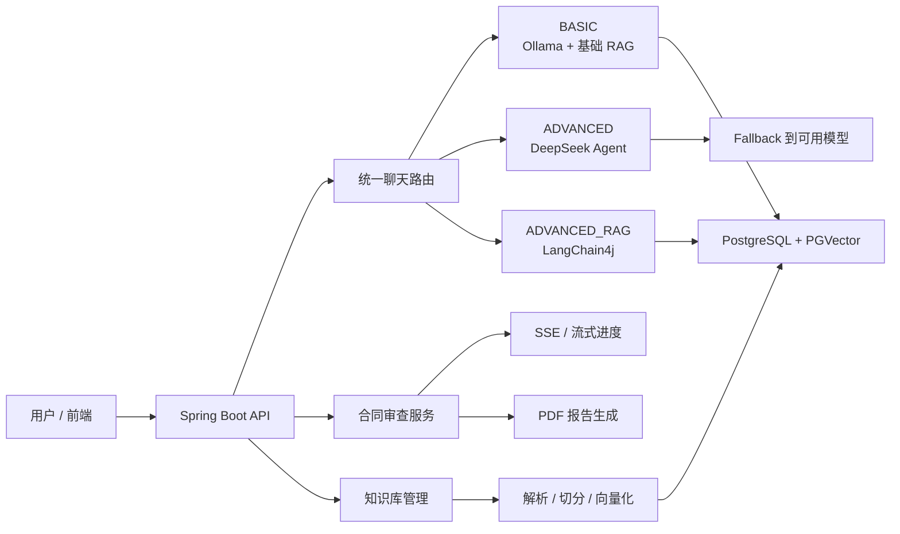

[简体中文](./README.md) | [English](./README_EN.md)

# 法律合规 AI 助手

一个面向法律问答、合同审查与知识库检索的 AI 应用项目。仓库采用 `Spring Boot + Spring AI + LangChain4j + Vue 3`，提供统一聊天入口、多模型路由、RAG 检索、Agent 能力、SSE 流式合同分析与 PDF 报告生成。

这个项目既可以作为一个可运行的法律合规助手，也适合作为 AI 工程化作品集项目来展示后端设计、RAG 集成、模型路由、可观测性和前后端协作能力。

## 功能概览

- **统一问答入口**：支持 `BASIC / ADVANCED / ADVANCED_RAG / UNIFIED` 四种模式
- **多模型路由**：根据问题复杂度在本地模型、DeepSeek Agent 和高级 RAG 之间切换
- **RAG 检索增强**：支持法律知识库导入、切分、向量化、检索和回答重建
- **合同审查工作流**：支持流式进度反馈、风险分析与报告生成
- **可解释响应 metadata**：返回 `actualModel`、`routeReason`、`fallbackUsed`、`sourceCount`、`latencyMs`
- **前后端分离**：Spring Boot 提供 API，Vue 3 + Vite 提供交互式前端页面

## 技术栈

- **后端**：Java 21、Spring Boot 3.3.4、Spring AI 1.0.2、Spring Security、Flyway
- **AI 能力**：LangChain4j、Ollama、DeepSeek、PGVector
- **数据库**：PostgreSQL 12+
- **前端**：Vue 3、Vite、TypeScript、Element Plus、Pinia
- **工程配套**：Knife4j、Actuator、PowerShell 启动脚本、评测脚本与演示文档

## 架构总览



详细设计见：

- [系统架构说明](./docs/architecture/system-overview.md)
- [演示脚本](./docs/interview/demo-script.md)
- [评测说明](./docs/evaluation/README.md)

## 模式设计

| 模式 | 典型用途 | 核心能力 | 适合场景 |
| --- | --- | --- | --- |
| `BASIC` | 基础法律问答 | 本地模型 + 基础检索 | 低成本本地复现 |
| `ADVANCED` | 复杂分析、工具调用 | DeepSeek Agent + fallback | 展示高级推理与可用性 |
| `ADVANCED_RAG` | 依赖知识库引用的问答 | 高级 RAG 检索链 | 强调回答可控性 |
| `UNIFIED` | 默认主路径 | 根据复杂度自动路由 | 日常演示与统一对外接口 |

## 快速开始

### 环境要求

- `Java 21+`
- `Node.js 18+`
- `PostgreSQL 12+`，并启用 `PGVector`
- 本地复现推荐安装 `Ollama`

### 1. 准备环境变量

复制示例配置：

```powershell
Copy-Item .env.example .env
```

至少需要填写以下变量：

- `DATABASE_URL`
- `DATABASE_USERNAME`
- `DATABASE_PASSWORD`
- `JWT_SECRET`

可选增强配置：

- `DEEPSEEK_API_KEY`
- `DEEPSEEK_CHAT_ENABLED`
- `OLLAMA_BASE_URL`

### 2. 启动后端

```powershell
powershell -ExecutionPolicy Bypass -File .\start-app.ps1
```

特点：

- 读取根目录 `.env`
- 可按环境自动启用或关闭 DeepSeek
- 保留完整的本地知识库与 RAG 链路

### 3. 启动前端

```powershell
cd .\legal-assistant-frontend
npm install
npm run dev
```

默认情况下：

- 后端地址：`http://localhost:8080`
- 前端开发服务：`http://localhost:5173`

### 4. 验证服务

- 健康检查：`http://localhost:8080/api/v1/health`
- 详细健康检查：`http://localhost:8080/api/v1/health/detailed`
- API 文档：`http://localhost:8080/api/v1/doc.html`

如需执行基础验证，可运行：

```powershell
mvn test
```

## 核心环境变量

| 变量名 | 用途 | 是否必填 |
| --- | --- | --- |
| `DEEPSEEK_API_KEY` | DeepSeek API Key | 可选 |
| `DEEPSEEK_CHAT_ENABLED` | 显式控制是否启用 DeepSeek | 可选 |
| `DATABASE_URL` | PostgreSQL 连接串 | 必填 |
| `DATABASE_USERNAME` | 数据库用户名 | 必填 |
| `DATABASE_PASSWORD` | 数据库密码 | 必填 |
| `JWT_SECRET` | JWT 签名密钥 | 强烈建议显式设置 |
| `ADMIN_PASSWORD` | 管理员密码 | 推荐设置 |
| `OLLAMA_BASE_URL` | 本地 Ollama 地址 | 本地模式推荐设置 |

> `src/main/resources/application.yml` 中包含开发用默认值；在公开仓库、远程部署或正式演示环境中，应始终通过环境变量覆盖 `JWT_SECRET`、数据库密码和管理员密码。

## 演示账号

数据库初始化完成后，可使用演示账号登录：

- 用户名：`demo`
- 密码：`123456`

> 该账号仅用于本地演示，不建议在公开部署环境中直接保留默认口令。

## 项目结构

```text
.
├─ docs/                         # 架构说明、评测脚本、演示材料
├─ legal-assistant-frontend/     # Vue 3 + Vite 前端
├─ src/main/java/                # Spring Boot 后端源码
├─ src/main/resources/           # 应用配置、Flyway、Prompt、模板与字体
├─ uploads/                      # 运行期上传文件（已忽略）
├─ documents/                    # 本地文档样本（已忽略）
└─ start-app.ps1                 # 本地启动脚本
```

## 文档导航

- [系统架构说明](./docs/architecture/system-overview.md)
- [项目简介](./docs/interview/project-brief.md)
- [演示脚本](./docs/interview/demo-script.md)
- [简历描述要点](./docs/interview/resume-bullets.md)
- [评测说明](./docs/evaluation/README.md)

## GitHub 发布说明

为了让仓库更适合公开发布，当前仓库约定如下：

- 敏感信息只保留在本地 `.env` 中，仓库中仅提交 `.env.example`
- 运行日志、构建产物、上传文件、前端依赖与前端打包结果均通过 `.gitignore` 排除
- 可选本地工具文件（如 `opentelemetry-javaagent.jar`）不建议继续纳入公开仓库

如果这些文件此前已经被 Git 跟踪，首次公开推送前可先从索引中移除：

```powershell
git rm -r --cached logs target uploads documents legal-assistant-frontend/node_modules legal-assistant-frontend/dist
git rm --cached .env opentelemetry-javaagent.jar
git add .gitignore README.md README_EN.md
git status
```

如果你怀疑 API Key、数据库密码或 JWT 密钥曾被提交过，建议在推送前先完成密钥轮换。

## 已知边界

- 当前配置更偏向演示和作品集展示，而非生产级多租户部署
- 法律问答与合同审查结果只能作为辅助意见，不能替代律师审阅
- RAG 效果依赖知识库文档质量、切分策略和向量检索参数
- 默认配置中的开发回退值仅适合本地环境，公开部署时必须改为真实安全配置

## 许可证

本项目使用 [Apache License 2.0](./LICENSE)。
