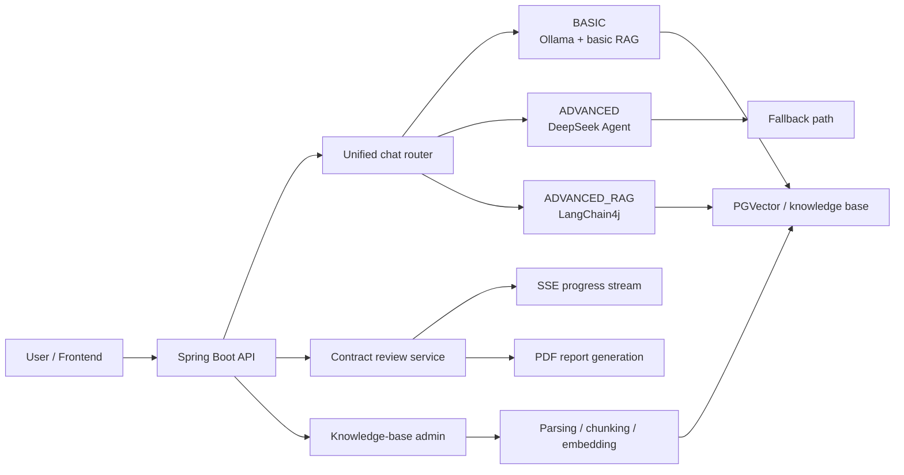

[简体中文](./README.md) | [English](./README_EN.md)

# Legal Compliance AI Assistant

An interview-ready AI application project for legal compliance scenarios. It combines `Spring AI + LangChain4j + RAG + Agent + SSE` to deliver unified chat, contract review, report generation, and knowledge-base management, with clear **routing, fallback, observability, verification, and demo materials**.

## Positioning

This is meant to look like an **AI engineering project**, not a toy app that only wraps one LLM API:

- Unified chat API across `BASIC / ADVANCED / ADVANCED_RAG / UNIFIED`
- Complexity-based routing between Agent and advanced RAG
- Knowledge-base ingestion, chunking, embedding, retrieval, and rebuild
- Streaming contract review with async progress updates
- Fallback behavior when DeepSeek is unavailable
- Stable response metadata for model, route, fallback, sources, and latency

## What changed in this sprint

### P0: remove interview red flags

- Replaced negative “no longer maintained” messaging
- Restored backend test credibility: `./mvnw test` passes
- `ADVANCED` now prefers DeepSeek but falls back instead of hard-failing
- Added an auth-header async contract analysis endpoint for the main demo flow
- Moved the password helper out of the main production source path

### P1: make AI engineering visible

- Standardized chat metadata fields:
  - `actualModel`
  - `routeReason`
  - `fallbackUsed`
  - `sourceCount`
  - `latencyMs`
- Frontend now exposes those metadata badges directly in chat
- Added reusable evaluation assets: `24` QA cases, `6` KB docs, `3` contracts
- Added architecture docs, demo scripts, resume bullets, and interview Q&A

### P2: make it demo-friendly

- Added a `demo` runtime profile for low-cost cloud demos
- Kept the local reproducible path with `Ollama + PostgreSQL/PGVector`
- Switched the contract review demo path to auth-header streaming

## Why both Spring AI and LangChain4j

- **Spring AI** fits the Spring Boot integration layer and model access layer
- **LangChain4j** is used for the more advanced RAG orchestration path
- The tradeoff is intentional: separate “platform integration” from “advanced retrieval workflow”

## Mode semantics

| Mode | Best for | Core value |
| --- | --- | --- |
| `BASIC` | low-cost local QA | local reproducibility |
| `ADVANCED` | complex analysis and tools | stronger reasoning + fallback |
| `ADVANCED_RAG` | retrieval-heavy legal QA | more controlled knowledge grounding |
| `UNIFIED` | main default flow | a single smart entry with routing |

## Architecture



More details:

- [Architecture overview](./docs/architecture/system-overview.md)
- [Demo script](./docs/interview/demo-script.md)

## Recommended demo flow

1. Login
2. Ask a simple question in `UNIFIED`
3. Ask a complex analysis question and show route / model / fallback / latency badges
4. Upload a contract and show async progress
5. Download the PDF report
6. Open the knowledge-base admin page and show upload/rebuild/stats

## Runtime modes

### 1. Cloud demo mode

Best for remote demo environments:

- prefers `DeepSeek API` as the main chat path
- does not require Ollama chat models for the primary demo storyline
- best for:
  - login + chat
  - contract review
  - report download

Run:

```bash
powershell -ExecutionPolicy Bypass -File .\start-demo.ps1
```

Required env vars:

- `DEEPSEEK_API_KEY`
- `DATABASE_URL`
- `DATABASE_USERNAME`
- `DATABASE_PASSWORD`
- `JWT_SECRET`

### 2. Local reproducible mode

Best for full local reproduction:

- `Ollama`
- PostgreSQL + `PGVector`
- full knowledge-base ingest and rebuild workflow

Backend:

```bash
powershell -ExecutionPolicy Bypass -File .\start-app.ps1
```

Frontend:

```bash
cd .\legal-assistant-frontend
npm install
npm run dev
```

## Quick start

### Requirements

- `Java 21+`
- `Node.js 18+`
- `PostgreSQL 12+` with `PGVector`
- `Ollama` for the local full-featured path

### Environment file

Copy `.env.example` to `.env` and fill in values.

### Health checks

- `http://localhost:8080/api/v1/health`
- `http://localhost:8080/api/v1/health/detailed`
- `http://localhost:8080/api/v1/doc.html`

### Demo account

- Username: `demo`
- Password: `123456`

> Demo only. Do not keep this account unchanged in a real deployment.

## Verification and evaluation assets

### Verified engineering evidence

| Item | Status | Notes |
| --- | --- | --- |
| Backend test suite | `81/81` passed | covers fallback, routing, metadata, contract stream |
| Frontend build | passed | `npm run build` succeeds |
| Fallback behavior | verified | `ADVANCED` no longer hard-fails without DeepSeek |
| Metadata stability | verified | stable keys returned to frontend |
| Contract async auth flow | verified | auth-header endpoint added for main demo |

### Included evaluation assets

- Dataset guide: `./docs/evaluation/README.md`
- QA cases: `./docs/evaluation/dataset/legal_qa_cases.json`
- Contract review cases: `./docs/evaluation/dataset/contract_review_cases.json`
- KB samples: `./docs/evaluation/dataset/knowledge-base/`
- Contract samples: `./docs/evaluation/dataset/contracts/`
- Result template: `./docs/evaluation/result-template.csv`
- Aggregation script: `./docs/evaluation/aggregate-results.ps1`

### Live AI benchmark (2026-03-08 local mixed-runtime baseline)

| Metric | Value | Notes |
| --- | --- | --- |
| Dataset size | `27` cases | `24` legal QA + `3` contract review |
| Retrieval hit rate | `0.0%` | aggregated from `retrieval_hit` |
| Answer completeness avg | `0.68 / 5` | aggregated from `answer_completeness` |
| Structured extraction success | `0.0%` | aggregated from `structured_success` |
| Overall P95 latency | `295,345 ms` | across all 27 cases |
| QA P95 latency | `57,219 ms` | across the 24 QA cases |
| Contract-review P95 latency | `310,328 ms` | across the 3 async review cases |
| Fallback trigger rate | `0.0%` | aggregated from `fallback_used` |

- Baseline database: clean temporary DB `legal_assistant_benchmark_20260308152141`
- KB ingestion path: `6` Markdown legal docs imported through the existing admin upload API, parser, chunker, and vectorization pipeline
- Runtime mix: `deepseek-chat` (`13` QA cases) + local LangChain4j retrieval path (`11` QA cases), with `qwen3:4b` and `nomic-embed-text`
- Route distribution: `simple_query=5`, `complex_analysis=7`, `advanced_rag_direct=6`, `default=6`
- Artifacts: `./docs/evaluation/benchmark-results.csv`, `./docs/evaluation/benchmark-summary.json`

> These are real benchmark outputs from the current implementation and model configuration, not aspirational numbers. For interview use, the key value is that the project now supports repeatable measurement, artifact retention, and clear next-step tuning.

## What to highlight in interviews

1. The unified API solves multi-model integration complexity
2. RAG and Agent are complementary, not redundant
3. Fallback behavior improves service credibility
4. Metadata makes AI outputs observable and explainable

## Document index

- [Architecture overview](./docs/architecture/system-overview.md)
- [Evaluation assets and protocol](./docs/evaluation/README.md)
- [Evaluation report template](./docs/evaluation/eval-report.md)
- [Interview brief and Q&A](./docs/interview/project-brief.md)
- [Resume bullets](./docs/interview/resume-bullets.md)
- [Demo script](./docs/interview/demo-script.md)

## License

See `LICENSE`.

