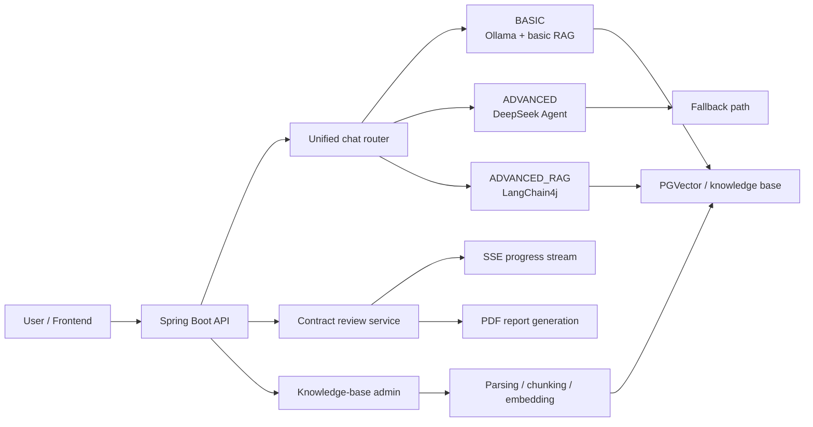

[简体中文](./README.md) | [English](./README_EN.md)

# Legal Compliance AI Assistant

An AI application for legal Q&A, contract review, and knowledge-base retrieval. The repository uses `Spring Boot + Spring AI + LangChain4j + Vue 3` and provides a unified chat entry, multi-model routing, RAG retrieval, agent capabilities, SSE-based contract analysis, and PDF report generation.

This project works both as a runnable legal compliance assistant and as an AI engineering portfolio project that demonstrates backend design, RAG integration, model routing, observability, and frontend/backend collaboration.

## Feature overview

- **Unified chat entry** across `BASIC / ADVANCED / ADVANCED_RAG / UNIFIED`
- **Multi-model routing** between local models, DeepSeek Agent, and advanced RAG
- **RAG workflow** for legal knowledge ingestion, chunking, vectorization, retrieval, and answer reconstruction
- **Contract review workflow** with streaming progress, risk analysis, and report generation
- **Explainable metadata** including `actualModel`, `routeReason`, `fallbackUsed`, `sourceCount`, and `latencyMs`
- **Separated frontend and backend** with Spring Boot APIs and a Vue 3 + Vite frontend

## Tech stack

- **Backend**: Java 21, Spring Boot 3.3.4, Spring AI 1.0.2, Spring Security, Flyway
- **AI stack**: LangChain4j, Ollama, DeepSeek, PGVector
- **Database**: PostgreSQL 12+
- **Frontend**: Vue 3, Vite, TypeScript, Element Plus, Pinia
- **Engineering support**: Knife4j, Actuator, PowerShell startup scripts, evaluation scripts, and architecture docs

## Architecture



More details:

- [Architecture overview](./docs/architecture/system-overview.md)
- [Demo script](./docs/interview/demo-script.md)

## Quick start

### Requirements

- `Java 21+`
- `Node.js 18+`
- `PostgreSQL 12+` with `PGVector`
- `Ollama` for the local reproducible path

### 1. Prepare environment variables

Copy the example file:

```powershell
Copy-Item .env.example .env
```

Required variables:

- `DATABASE_URL`
- `DATABASE_USERNAME`
- `DATABASE_PASSWORD`
- `JWT_SECRET`

Optional enhancements:

- `DEEPSEEK_API_KEY`
- `DEEPSEEK_CHAT_ENABLED`
- `OLLAMA_BASE_URL`

### 2. Start the backend

```powershell
powershell -ExecutionPolicy Bypass -File .\start-app.ps1
```

Notes:

- Loads environment variables from the root `.env`
- Enables or disables DeepSeek automatically based on available config
- Preserves the full local knowledge-base and RAG workflow

### 3. Start the frontend

```powershell
cd .\legal-assistant-frontend
npm install
npm run dev
```

Default local endpoints:

- Backend: `http://localhost:8080`
- Frontend dev server: `http://localhost:5173`

### 4. Verify the service

- `http://localhost:8080/api/v1/health`
- `http://localhost:8080/api/v1/health/detailed`
- `http://localhost:8080/api/v1/doc.html`

Optional basic verification:

```powershell
mvn test
```

## Core environment variables

| Variable | Purpose | Required |
| --- | --- | --- |
| `DEEPSEEK_API_KEY` | DeepSeek API key | Optional |
| `DEEPSEEK_CHAT_ENABLED` | Explicit toggle for DeepSeek chat | Optional |
| `DATABASE_URL` | PostgreSQL connection string | Required |
| `DATABASE_USERNAME` | Database username | Required |
| `DATABASE_PASSWORD` | Database password | Required |
| `JWT_SECRET` | JWT signing secret | Strongly recommended |
| `ADMIN_PASSWORD` | Admin password | Recommended |
| `OLLAMA_BASE_URL` | Local Ollama endpoint | Recommended for local mode |

> `src/main/resources/application.yml` contains development-friendly fallbacks. For a public repository or any remote deployment, override JWT secrets, database passwords, and admin credentials through environment variables.

### Demo account

- Username: `demo`
- Password: `123456`

> Demo only. Do not keep this account unchanged in a real deployment.

## Project structure

```text
.
├─ docs/                         # Architecture, evaluation, and interview materials
├─ legal-assistant-frontend/     # Vue 3 + Vite frontend
├─ src/main/java/                # Spring Boot backend source
├─ src/main/resources/           # App config, Flyway, prompts, templates, fonts
├─ uploads/                      # Runtime uploads (ignored)
├─ documents/                    # Local document samples (ignored)
└─ start-app.ps1                 # Local startup script
```

## Document index

- [Architecture overview](./docs/architecture/system-overview.md)
- [Project brief](./docs/interview/project-brief.md)
- [Demo script](./docs/interview/demo-script.md)
- [Resume bullets](./docs/interview/resume-bullets.md)
- [Evaluation guide](./docs/evaluation/README.md)

## GitHub publishing notes

- Keep secrets only in the local `.env` file and commit `.env.example` instead
- Ignore logs, build outputs, uploads, frontend dependencies, and frontend bundles through `.gitignore`
- Keep optional local tools such as `opentelemetry-javaagent.jar` out of the public repository

If those files were already tracked before `.gitignore` was updated, remove them from the Git index first:

```powershell
git rm -r --cached logs target uploads documents legal-assistant-frontend/node_modules legal-assistant-frontend/dist
git rm --cached .env opentelemetry-javaagent.jar
git add .gitignore README.md README_EN.md
git status
```

If any API keys, database passwords, or JWT secrets were committed in the past, rotate them before pushing to GitHub.

## Known limitations

- The current setup is optimized for demos and portfolio presentation, not for production-grade multi-tenant deployment
- Legal Q&A and contract review outputs are assistant results only and cannot replace a lawyer's review
- RAG quality depends on document quality, chunking strategy, and retrieval settings
- Development fallback values in config files should be replaced with secure environment variables in any public or remote deployment

## License

This project uses [Apache License 2.0](./LICENSE).

