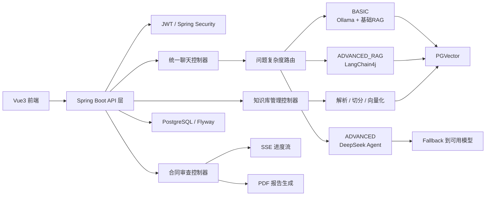
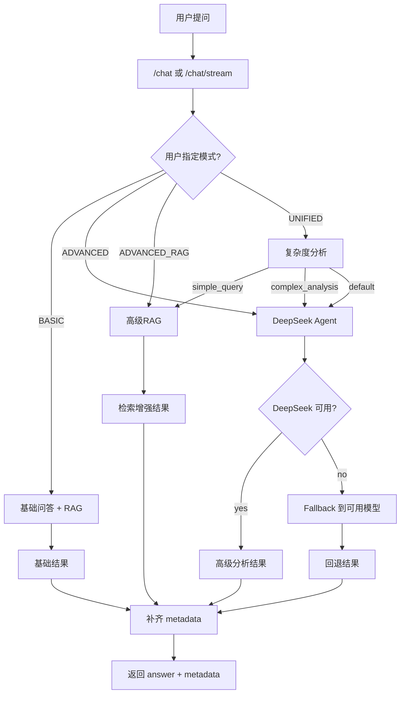
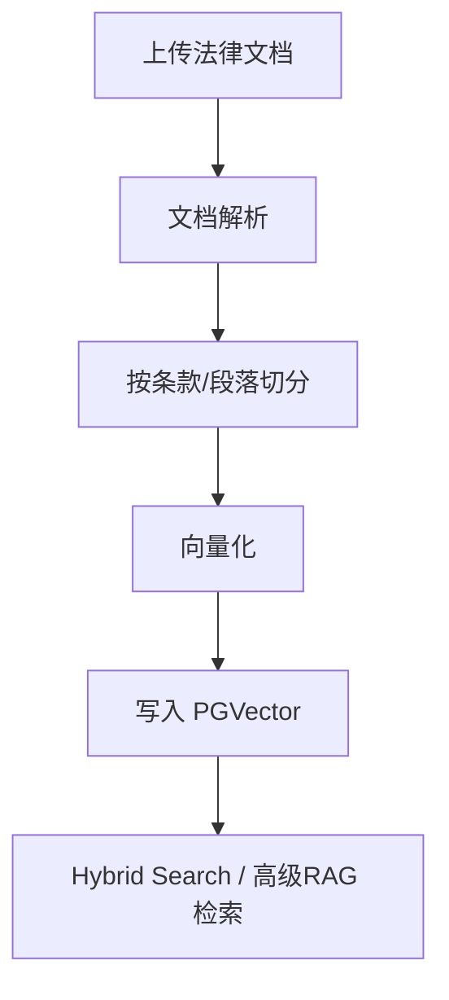
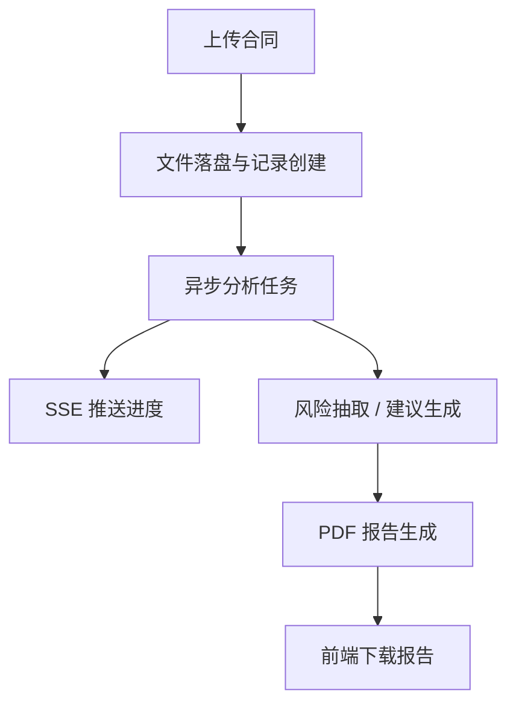

# 法律合规 AI 项目架构说明

## 1. 项目要解决的问题

这个项目面向两个真实场景：

- **法律问答**：用户希望快速获得基于知识库的合规问答结果
- **合同审查**：用户希望上传合同后获得风险点、修改建议和可下载报告

难点不在于“能不能调起模型”，而在于：

- 不同类型问题需要不同能力链路
- 高级模型不稳定时不能让系统整体不可用
- 前端需要知道这次回答到底走了什么路径
- 合同审查耗时长，必须支持异步进度与结果回传

## 2. 为什么是双框架方案

### Spring AI

负责更贴近 Spring Boot 工程体系的一层：

- 模型接入
- `ChatClient` 集成
- Spring 生态下的配置与依赖管理

### LangChain4j

负责更强调检索编排的一层：

- 高级 RAG 链路
- 查询转换
- 多阶段召回与重排序

### 设计结论

本项目不是为了“堆技术栈”，而是将：

- **模型接入**
- **高级检索编排**

拆分为两套更容易解释的职责边界，方便在面试中讲清楚“为什么不是所有问题都走同一条链路”。

## 3. 系统总览

## 4. 统一聊天请求流转

## 5. 知识库入库链路

## 6. 合同审查链路

## 7. 为什么要保留多模式

| 模式 | 保留原因 | 典型 trade-off |
| --- | --- | --- |
| `BASIC` | 低成本、本地可复现 | 能力弱但依赖最少 |
| `ADVANCED` | 复杂分析与工具调用 | 效果更强，但依赖 API 可用性 |
| `ADVANCED_RAG` | 引用知识库更稳定 | 更可控，但链路更重 |
| `UNIFIED` | 统一对外接口 | 需要额外路由逻辑与解释信息 |

## 8. 可观测性设计

统一聊天结果固定暴露以下 metadata：

| 字段 | 含义 | 面试价值 |
| --- | --- | --- |
| `actualModel` | 实际执行模型 | 不是“用户选了什么”，而是“系统真正用了什么” |
| `routeReason` | 路由原因 | 展示智能分流而不是拍脑袋切换 |
| `fallbackUsed` | 是否降级 | 体现高可用设计 |
| `sourceCount` | 检索来源数量 | 体现回答 grounding 强度 |
| `latencyMs` | 本次耗时 | 支持演示与性能对比 |

## 9. 面试时推荐的讲法

建议按下面顺序回答架构问题：

1. 先讲**业务场景**
2. 再讲**为什么需要多条 AI 链路**
3. 再讲**为什么要做统一接口**
4. 最后讲**fallback、metadata、SSE** 这些工程化细节

这样比“先背技术名词”更像真正做过项目的人。

